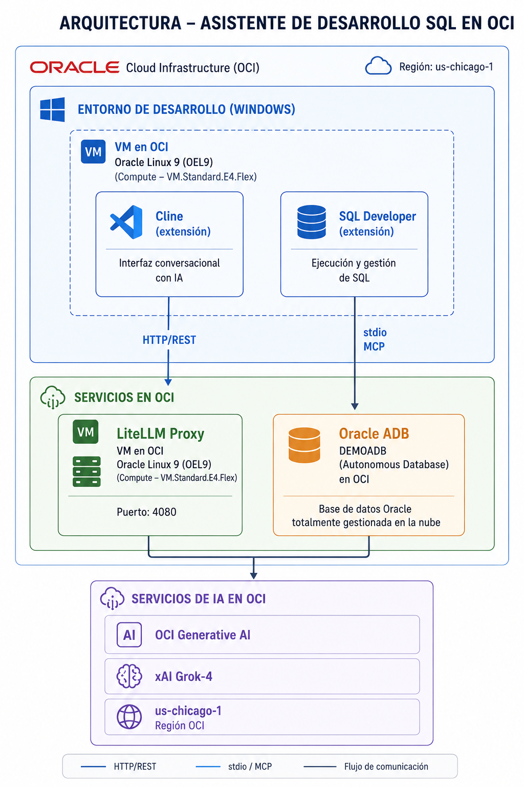
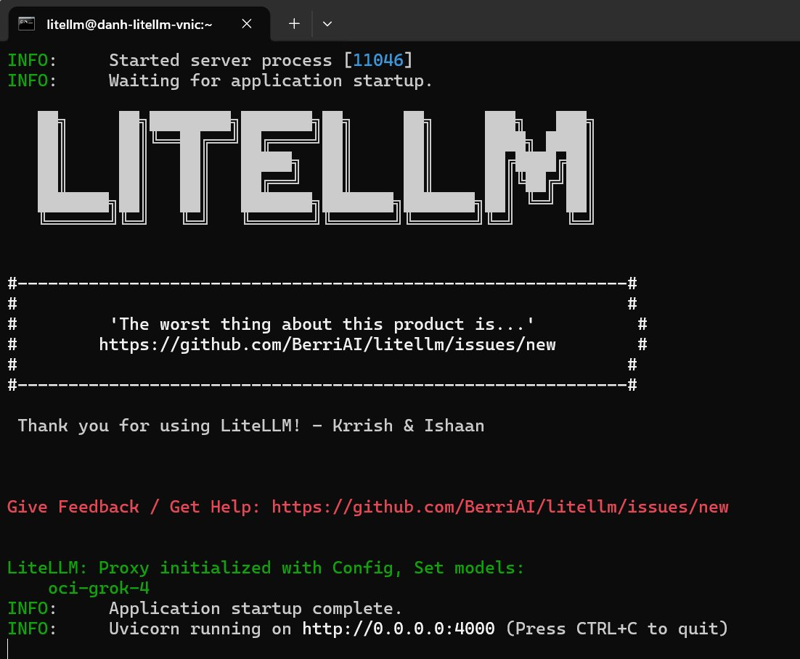
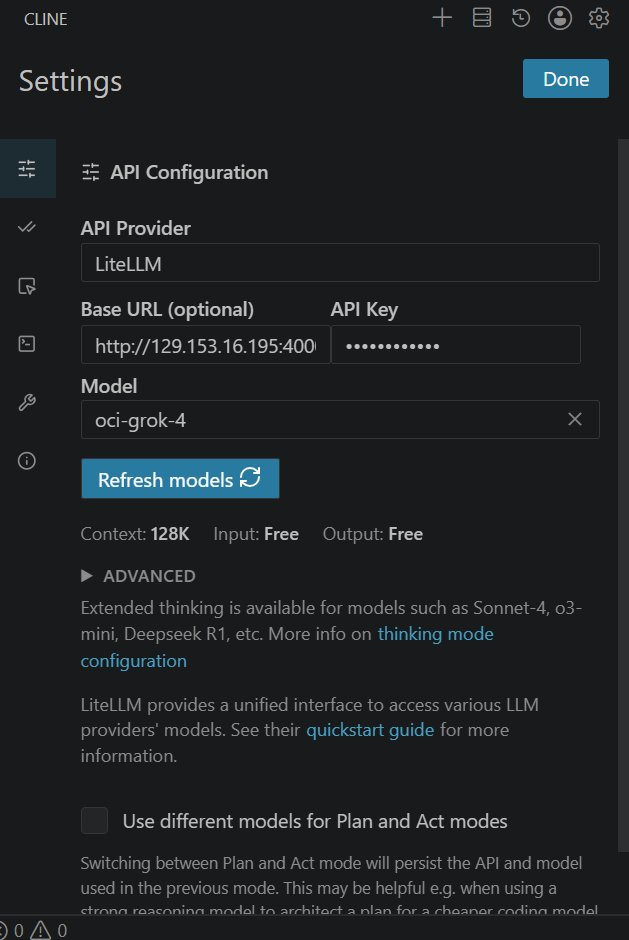
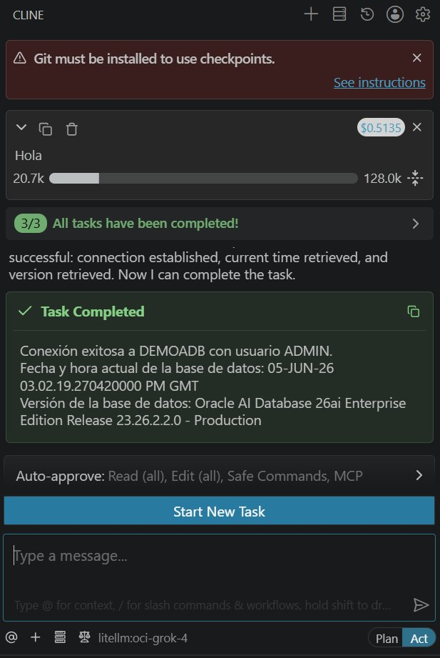
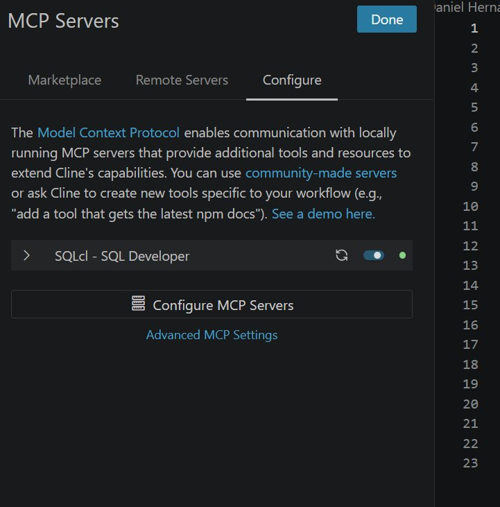

# Guía Completa: Cline + LiteLLM + OCI Generative AI (Grok-4) en Oracle Linux 9

## Arquitectura



---

## Prerrequisitos en Windows (máquina cliente)

Antes de comenzar, instala las siguientes herramientas en tu PC:

### Visual Studio Code

Descarga e instala VS Code desde:

```text
https://code.visualstudio.com/
```

### Extensión Cline

1. Abre VS Code
2. Ve a **Extensions** (`Ctrl+Shift+X`)
3. Busca **Cline**
4. Haz clic en **Install**

### Extensión SQL Developer (para MCP Server)

1. En VS Code, ve a **Extensions** (`Ctrl+Shift+X`)
2. Busca **Oracle SQL Developer Extension for VS Code**
3. Haz clic en **Install**

> Esta extensión incluye el runtime Java y SQLcl necesarios para el servidor MCP.

---

## 1. Políticas IAM OCI para Generative AI

### Crear grupo

```text
AI-Users
```

Agrega el usuario OCI a ese grupo.

### Política mínima recomendada (compartment específico)

```text
Allow group AI-Users to use generative-ai-family in compartment <COMPARTMENT_NAME>
```

Ejemplo:

```text
Allow group AI-Users to use generative-ai-family in compartment Shared-AI
```

### Política a nivel tenancy

```text
Allow group AI-Users to use generative-ai-family in tenancy
```

### Verificar acceso

```text
OCI Console → Generative AI → Playground → Ejecutar prompt
```

---

## 2. Crear API Key OCI

La forma recomendada es generar el par de claves directamente desde la consola OCI, que se encarga de todo automáticamente.

### Pasos en OCI Console

1. Inicia sesión en [https://cloud.oracle.com](https://cloud.oracle.com)
2. Haz clic en el ícono de perfil (esquina superior derecha) → **User Settings**
3. En el menú izquierdo, selecciona **API Keys**
4. Haz clic en **Add API Key**
5. Selecciona **Generate API Key Pair**
6. Haz clic en **Download Private Key** → guarda el archivo `oci_api_key.pem` en un lugar seguro
7. Haz clic en **Add**

### Guardar los datos de configuración

Después de agregar la clave, OCI muestra un resumen de configuración similar a este:

```ini
[DEFAULT]
user=ocid1.user.oc1..aaaaaaaaxxx
fingerprint=7a:c4:xx:xx:xx:xx:xx:xx:xx:xx:xx:xx:xx:xx:xx:xx
tenancy=ocid1.tenancy.oc1..aaaaaaaaxxx
region=us-chicago-1
key_file=~/.oci/oci_api_key.pem
```

Copia y guarda este bloque — contiene todos los valores que necesitarás para configurar LiteLLM:

| Valor | Dónde se usa en `config.yaml` |
|---|---|
| `user` | `oci_user` |
| `fingerprint` | `oci_fingerprint` |
| `tenancy` | `oci_tenancy` |
| `key_file` | `oci_key_file` |

---

## 3. Crear VM Oracle Linux 9 en OCI

Shape recomendado:

```text
Shape: VM.Standard.E4.Flex
OCPU: 1
RAM: 8 GB
OS: Oracle Linux 9
```

---

## 4. Configurar red OCI (Ingress Rule)

Agrega la siguiente regla de entrada en el Security List o NSG de la VM:

| Campo    | Valor                    |
|----------|--------------------------|
| Source   | `<tu red corporativa>`   |
| Protocol | TCP                      |
| Port     | 4000                     |

---

## 5. Instalar dependencias en OEL9

```bash
sudo dnf update -y
sudo dnf install -y python3.11 python3.11-pip python3.11-devel git
```

---

## 6. Crear usuario de servicio

```bash
sudo useradd -m -s /bin/bash litellm
sudo passwd litellm
sudo su - litellm
```

---

## 7. Crear entorno virtual Python

En OEL9, SELinux bloquea la ejecución de binarios desde `/home` cuando son invocados por systemd, aunque los permisos Unix sean correctos (error `status=203/EXEC` en journald). Por eso el virtualenv debe crearse en `/opt`:

```bash
sudo mkdir -p /opt/litellm-env
sudo chown litellm:litellm /opt/litellm-env
sudo -u litellm python3.11 -m venv /opt/litellm-env
```

---

## 8. Instalar LiteLLM

```bash
sudo -u litellm /opt/litellm-env/bin/pip install --upgrade pip
sudo -u litellm /opt/litellm-env/bin/pip install "litellm[proxy]" oci
```

---

## 9. Configurar OCI API Key en la VM

Copia tu archivo `oci_api_key.pem` a la VM y configura los permisos:

```bash
mkdir -p ~/.oci
# Copia tu clave privada aquí: ~/.oci/oci_api_key.pem
chmod 700 ~/.oci
chmod 600 ~/.oci/oci_api_key.pem
```

---

## 10. Configuración LiteLLM

Crea el directorio y el archivo de configuración:

```bash
mkdir -p ~/litellm
vi ~/litellm/config.yaml
```

Contenido del archivo:

```yaml
litellm_settings:
  drop_params: true
  set_verbose: false

model_list:
  - model_name: oci-grok-4
    litellm_params:
      model: oci/xai.grok-4
      stream: false
      oci_region: us-chicago-1
      oci_user: <USER_OCID>
      oci_fingerprint: <FINGERPRINT>
      oci_tenancy: <TENANCY_OCID>
      oci_compartment_id: <COMPARTMENT_OCID>
      oci_key_file: /home/litellm/.oci/oci_api_key.pem

general_settings:
  master_key: sk-oci-proxy
```

> **Nota:** `stream: false` es importante para asegurar compatibilidad con Cline. Sin esta opción, Cline puede quedar esperando indefinidamente aunque el proxy responda bien a llamadas curl estándar.

---

## 11. Prueba manual del proxy

Inicia el proxy manualmente para verificar que todo funciona antes de registrarlo como servicio:

```bash
sudo -u litellm /opt/litellm-env/bin/litellm \
  --config /home/litellm/litellm/config.yaml \
  --host 0.0.0.0 \
  --port 4000
```

Cuando el servidor inicie correctamente verás una pantalla como esta:



El log confirma:
- **Proxy initialized with Config, Set models: oci-grok-4** — el modelo fue cargado
- **Application startup complete** — la aplicación está lista
- **Uvicorn running on http://0.0.0.0:4000** — escuchando en todas las interfaces

### Verificar modelos disponibles

```bash
curl http://localhost:4000/v1/models \
  -H "Authorization: Bearer sk-oci-proxy"
```

### Prueba de chat completa

```bash
curl http://localhost:4000/v1/chat/completions \
  -H "Authorization: Bearer sk-oci-proxy" \
  -H "Content-Type: application/json" \
  -d '{
    "model": "oci-grok-4",
    "messages": [
      {"role": "user", "content": "Hola, ¿cómo estás?"}
    ]
  }'
```

Si el proxy responde correctamente aquí, la cadena OCI → LiteLLM está operativa.

---

## 12. Configurar firewalld en OEL9

```bash
sudo firewall-cmd --permanent --zone=public --add-port=4000/tcp
sudo firewall-cmd --reload
sudo firewall-cmd --list-ports
```

Resultado esperado:

```text
4000/tcp
```

---

## 13. Registrar LiteLLM como servicio systemd

Crea el archivo de servicio:

```bash
sudo vi /etc/systemd/system/litellm.service
```

```ini
[Unit]
Description=LiteLLM Proxy
After=network.target

[Service]
Type=simple
User=litellm
Group=litellm

WorkingDirectory=/home/litellm/litellm

ExecStart=/opt/litellm-env/bin/litellm \
  --config /home/litellm/litellm/config.yaml \
  --host 0.0.0.0 \
  --port 4000

Restart=always
RestartSec=10
Environment=PYTHONUNBUFFERED=1

[Install]
WantedBy=multi-user.target
```

> **Puntos clave del servicio:**
> - `User=litellm` — corre con el usuario de servicio dedicado, no como root
> - `ExecStart` apunta al virtualenv en `/opt` — necesario porque SELinux en OEL9 bloquea la ejecución de binarios desde `/home` cuando son invocados por systemd
> - `Restart=always` — se reinicia automáticamente si el proceso falla
> - `RestartSec=10` — espera 10 segundos entre reinicios para evitar loops
> - `PYTHONUNBUFFERED=1` — los logs aparecen en tiempo real en journald

Activa e inicia el servicio:

```bash
sudo systemctl daemon-reload
sudo systemctl enable litellm
sudo systemctl start litellm
```

### Comandos de administración

```bash
# Ver estado del servicio
sudo systemctl status litellm

# Ver logs en tiempo real
sudo journalctl -u litellm -f

# Reiniciar tras modificar config.yaml
sudo systemctl restart litellm

# Detener el servicio
sudo systemctl stop litellm
```

---

## 14. Configurar Cline en VS Code

Abre la configuración de Cline y usa los siguientes parámetros:

| Campo        | Valor                          |
|--------------|-------------------------------|
| API Provider | `LiteLLM`                     |
| Base URL     | `http://<IP_VM>:4000`         |
| API Key      | `sk-oci-proxy`                |
| Model        | `oci-grok-4`                  |



> **Alternativa con OpenAI Compatible:** Si prefieres usar el provider genérico, usa `Base URL: http://<IP_VM>:4000/v1`

---

## 15. Validación final desde Cline

Una vez configurado, envía un mensaje de prueba desde Cline. Si todo está correctamente configurado, verás una respuesta similar a la siguiente:



La respuesta confirma:
- **3/3 All tasks have been completed!** — Cline procesó la solicitud exitosamente
- Conexión a Oracle Autonomous Database establecida vía MCP
- Modelo activo: `litellm:oci-grok-4` (visible en la barra inferior)
- Costo de la llamada: `$0.5135` (visible en la esquina superior)

### Validación con curl desde el cliente

```bash
curl http://<IP_VM>:4000/v1/chat/completions \
  -H "Authorization: Bearer sk-oci-proxy" \
  -H "Content-Type: application/json" \
  -d '{
    "model": "oci-grok-4",
    "messages": [
      {"role": "user", "content": "Hola"}
    ]
  }'
```

Si responde correctamente, la cadena completa queda operativa:

```text
Cline → LiteLLM Proxy → OCI Generative AI → xAI Grok-4
```

---

## 16. Configurar MCP Server (SQLcl) en Cline

El MCP Server permite a Cline interactuar directamente con Oracle Database usando lenguaje natural.

### Acceder a la configuración MCP

En Cline, haz clic en el ícono de herramientas y selecciona **MCP Servers**:



### Configurar el servidor

Haz clic en **Configure MCP Servers** y edita el archivo `cline_mcp_settings.json` con el siguiente contenido:

```json
{
  "mcpServers": {
    "SQLcl - SQL Developer": {
      "timeout": 60,
      "type": "stdio",
      "command": "C:\\Users\\<TU_USUARIO>\\.vscode\\extensions\\oracle.sql-developer-26.1.2-win32-x64\\dbtools\\jdk\\bin\\java.exe",
      "args": [
        "-Djava.awt.headless=true",
        "-Djava.net.useSystemProxies=true",
        "-Duser.language=en",
        "-p",
        "C:\\Users\\<TU_USUARIO>\\.vscode\\extensions\\oracle.sql-developer-26.1.2-win32-x64\\dbtools\\launch\\;C:\\Users\\<TU_USUARIO>\\.vscode\\extensions\\oracle.sql-developer-26.1.2-win32-x64\\dbtools\\sqlcl\\launch\\",
        "--add-modules",
        "ALL-DEFAULT",
        "-m",
        "com.oracle.dbtools.launch",
        "sql",
        "-mcp"
      ],
      "env": {}
    }
  }
}
```

> Reemplaza `<TU_USUARIO>` con tu nombre de usuario de Windows.

### Explicación de los parámetros

| Parámetro | Descripción |
|-----------|-------------|
| `timeout` | Tiempo máximo en segundos que Cline espera respuesta del MCP Server antes de cancelar |
| `type: stdio` | Protocolo de comunicación: JSON-RPC 2.0 sobre stdin/stdout (no requiere puerto de red) |
| `command` | Ruta absoluta al JDK incluido en la extensión SQL Developer de VS Code |
| `-Djava.awt.headless=true` | Ejecuta Java sin interfaz gráfica (modo servidor) |
| `-Djava.net.useSystemProxies=true` | Hereda la configuración de proxy del sistema operativo |
| `-Duser.language=en` | Fuerza mensajes del JVM en inglés para mejor compatibilidad con el parsing del LLM |
| `-p` | Java module path: incluye los JARs de SQLcl necesarios para el MCP |
| `--add-modules ALL-DEFAULT` | Habilita todos los módulos Java del path indicado |
| `-m com.oracle.dbtools.launch` | Módulo principal de arranque de SQLcl |
| `sql -mcp` | Inicia SQLcl en modo MCP (Model Context Protocol), exponiendo herramientas de base de datos a Cline |

### Verificar que el MCP Server está activo

En la pantalla de MCP Servers, el servidor debe mostrar un punto verde indicando que está conectado y listo:


### Uso básico con MCP

Una vez configurado, puedes pedirle a Cline cosas como:

```text
Conéctate a DEMOADB con usuario ADMIN y dime la versión de la base de datos
```

Cline utilizará automáticamente las herramientas MCP de SQLcl para ejecutar las consultas necesarias.

---

## Resumen de la arquitectura completa

```text
┌─────────────────────────────────┐
│         VS Code (Windows)       │
│                                 │
│  ┌──────────┐  ┌─────────────┐  │
│  │  Cline   │  │SQL Developer│  │
│  │(extensión)│  │ (extensión) │  │
│  └────┬─────┘  └──────┬──────┘  │
│       │               │         │
│       │ HTTP/REST      │ stdio   │
│       │               │ MCP     │
└───────┼───────────────┼─────────┘
        │               │
        ▼               ▼
┌───────────────┐  ┌────────────────┐
│ LiteLLM Proxy │  │ Oracle ADB     │
│ (OEL9 VM)     │  │ (DEMOADB)      │
│ :4000         │  │                │
└───────┬───────┘  └────────────────┘
        │
        ▼
┌───────────────────┐
│ OCI Generative AI │
│ xAI Grok-4        │
│ us-chicago-1      │
└───────────────────┘
```

---

## Referencias

- **[LiteLLM — OCI Generative AI Provider](https://docs.litellm.ai/docs/providers/oci)**
  Documentación oficial de LiteLLM sobre la integración con Oracle Cloud Infrastructure Generative AI. Incluye los parámetros de configuración soportados, modelos disponibles, ejemplos de uso con Python SDK y proxy, y opciones de autenticación con OCI.
